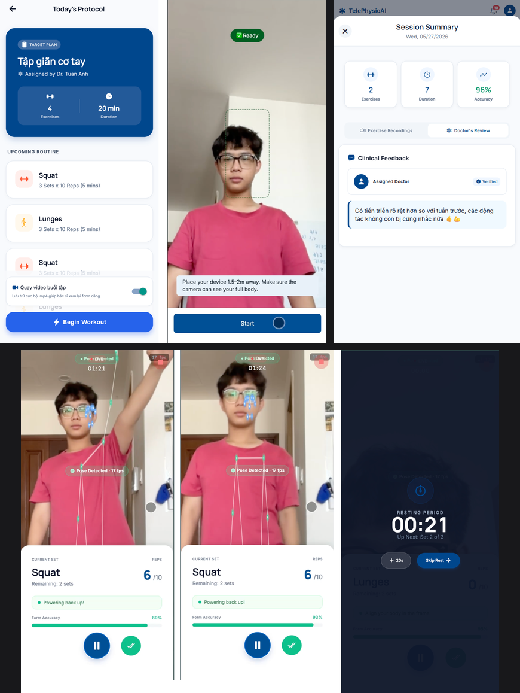
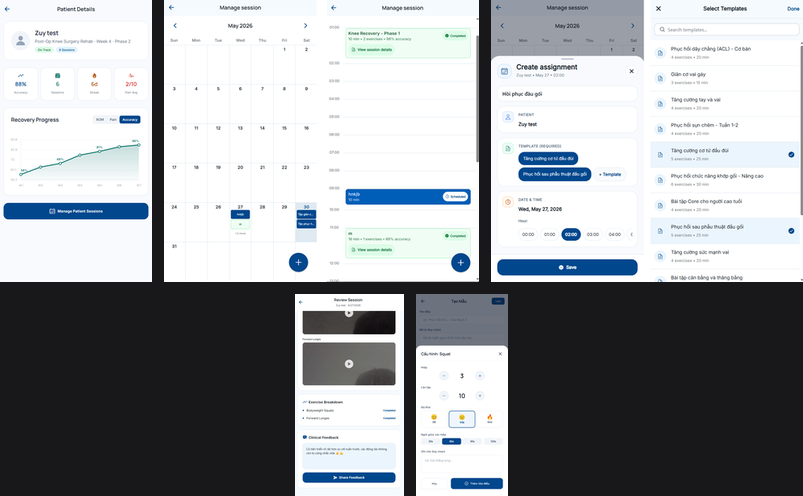

<div align="center">

# TelePhysio AI

**Hệ thống hỗ trợ phục hồi vận động từ xa tích hợp trí tuệ nhân tạo**

[](https://expo.dev)
[](https://reactnative.dev)
[](https://www.typescriptlang.org)
[](https://firebase.google.com)
[](#)

[Giới thiệu](#giới-thiệu) &bull; [Tính năng](#tính-năng) &bull; [Công nghệ](#công-nghệ) &bull; [Bắt đầu](#bắt-đầu) &bull; [Cấu trúc dự án](#cấu-trúc-dự-án) &bull; [Tài liệu](#tài-liệu)

</div>

## Giới thiệu

TelePhysio AI là ứng dụng di động hỗ trợ phục hồi vận động từ xa, sử dụng AI để theo dõi tư thế người tập trong thời gian thực. Ứng dụng phục vụ hai vai trò:

- **Bệnh nhân**: Luyện tập các bài tập được bác sĩ kê đơn, xem lại kết quả và tiến độ phục hồi.
- **Bác sĩ**: Quản lý bệnh nhân, giao bài tập, theo dõi buổi tập và đưa ra phản hồi chuyên môn.

Hệ thống sử dụng **MediaPipe BlazePose** để phân tích tư thế qua camera, tự động đếm số lần lặp và đánh giá độ chính xác của động tác.

## Tính năng

### Giao diện bệnh nhân

<div align="center">
  
</div>

### Giao diện bác sĩ

<div align="center">
  
</div>

## Công nghệ

| Lớp | Công nghệ |
|---|---|
| **Framework** | Expo SDK 55, React Native 0.83, React 19 |
| **Ngôn ngữ** | TypeScript |
| **Điều hướng** | React Navigation 6 (native-stack + bottom-tabs) |
| **Backend** | Firebase (Auth, Firestore, Storage) |
| **Video** | Cloudinary (upload unsigned presets) |
| **AI/ML** | MediaPipe BlazePose (qua WebView), PoseAnalyzer tùy chỉnh |
| **Quản lý state** | Zustand, React Context |
| **Đa ngôn ngữ** | i18next + react-i18next + expo-localization |
| **DevOps** | Docker, Docker Compose, GitHub Actions CI |
| **Build** | EAS Build (development / preview / production) |

## Bắt đầu

### Yêu cầu hệ thống

- [Node.js 20+](https://nodejs.org/)
- [Docker Desktop](https://www.docker.com/products/docker-desktop/) (khuyến nghị)
- [Expo Go](https://expo.dev/go) trên điện thoại (hoặc emulator)

### Cài đặt

1. **Clone repository**

   ```bash
   git clone <repo-url>
   cd telephysio-ai
   ```

2. **Cấu hình biến môi trường**

   ```bash
   cp telephysio-ai-mobile/.env.example telephysio-ai-mobile/.env
   ```

   Điền các giá trị Firebase vào file `.env`. Xem hướng dẫn tại [`docs/FIREBASE_CONFIG.md`](telephysio-ai-mobile/docs/FIREBASE_CONFIG.md).

3. **Khởi động với Docker** (khuyến nghị)

   ```bash
   cd telephysio-ai-mobile
   docker compose up --build
   ```

4. **Mở ứng dụng**

   Quét QR code bằng Expo Go, hoặc mở trên emulator:
   ```bash
   npm run android   # Android
   npm run ios       # iOS
   npm run web       # Web
   ```

### Các lệnh thường dùng

| Lệnh | Mô tả |
|---|---|
| `docker compose up --build` | Khởi động app qua Docker |
| `docker compose build --no-cache` | Build lại khi thay đổi `package.json` |
| `docker compose run --rm expo npm run docker:start:clear` | Xóa cache và khởi động lại |
| `docker compose run --rm expo npx expo-doctor` | Kiểm tra tương thích dependency |
| `docker compose run --rm expo npx tsc --noEmit` | Kiểm tra lỗi TypeScript |

> [!NOTE]
> Nếu dùng Windows + WSL2 và Expo Go không kết nối được dev server, xem hướng dẫn tại [`docs/SETUP_GUIDE.md`](telephysio-ai-mobile/docs/SETUP_GUIDE.md).

## Cấu trúc dự án

```
telephysio-ai/
├── telephysio-ai-mobile/          # Ứng dụng chính
│   ├── App.tsx                    # Entry point
│   ├── src/
│   │   ├── components/            # Components tái sử dụng
│   │   │   ├── PoseEstimationView/# AI pose tracking (WebView + MediaPipe)
│   │   │   └── ui/                # Design system (AppText, AppButton, Card...)
│   │   ├── contexts/              # React Context (AuthContext)
│   │   ├── i18n/                  # Đa ngôn ngữ (en, vi)
│   │   ├── navigation/            # Điều hướng theo vai trò
│   │   ├── screens/               # Màn hình theo feature
│   │   │   ├── Auth/              # Đăng nhập, đăng ký
│   │   │   ├── Home/              # Trang chủ bệnh nhân
│   │   │   ├── Training/          # Luyện tập với AI
│   │   │   ├── Workout/           # Quản lý bài tập
│   │   │   ├── Session/           # Lịch sử buổi tập
│   │   │   ├── Doctor/            # Giao diện bác sĩ
│   │   │   ├── Profile/           # Hồ sơ cá nhân
│   │   │   └── Progress/          # Tiến độ phục hồi
│   │   ├── services/              # Service layer
│   │   │   └── firebase/          # Firebase services (Auth, Firestore, Storage)
│   │   └── theme/                 # Design tokens (colors, typography, spacing)
│   ├── scripts/                   # Seed scripts
│   ├── docs/                      # Tài liệu dự án
│   ├── assets/                    # Hình ảnh, models, âm thanh
│   ├── Dockerfile                 # Docker configuration
│   ├── docker-compose.yml         # Docker Compose
│   └── package.json
├── .github/workflows/ci.yml      # CI pipeline
└── AGENTS.md                      # AI agent configuration
```

## Tài liệu

| Tài liệu | Mô tả |
|---|---|
| [`docs/SETUP_GUIDE.md`](telephysio-ai-mobile/docs/SETUP_GUIDE.md) | Hướng dẫn cài đặt chi tiết |
| [`docs/DESIGN.md`](telephysio-ai-mobile/docs/DESIGN.md) | Hệ thống thiết kế "Clinical Vitality" |
| [`docs/FIREBASE_CONFIG.md`](telephysio-ai-mobile/docs/FIREBASE_CONFIG.md) | Hướng dẫn cấu hình Firebase |
| [`docs/FIREBASE_ARCHITECTURE.md`](telephysio-ai-mobile/docs/FIREBASE_ARCHITECTURE.md) | Kiến trúc Firebase và sơ đồ ERD |
| [`docs/firebase-schema-reference.md`](telephysio-ai-mobile/docs/firebase-schema-reference.md) | Tham chiếu schema Firestore |

## Quy tắc làm việc nhóm

1. **Không code trực tiếp trên `main`** — mỗi thay đổi đi từ branch riêng.
2. **Mỗi task một branch** — ví dụ: `feature/session-camera`, `fix/firebase-env`.
3. **Cập nhật từ `main` trước khi mở PR** — tránh conflict kéo dài.
4. **Chỉ commit file liên quan đến task** — không gom nhiều thay đổi không liên quan.
5. **Không commit file bí mật** — `.env` phải được gitignore.
6. **Chạy kiểm tra trước khi push**:
   ```bash
   docker compose run --rm expo npx expo-doctor
   docker compose run --rm expo npx tsc --noEmit
   ```
7. **Khi thay đổi dependency Expo**, dùng:
   ```bash
   docker compose run --rm expo npx expo install <tên-package>
   ```
