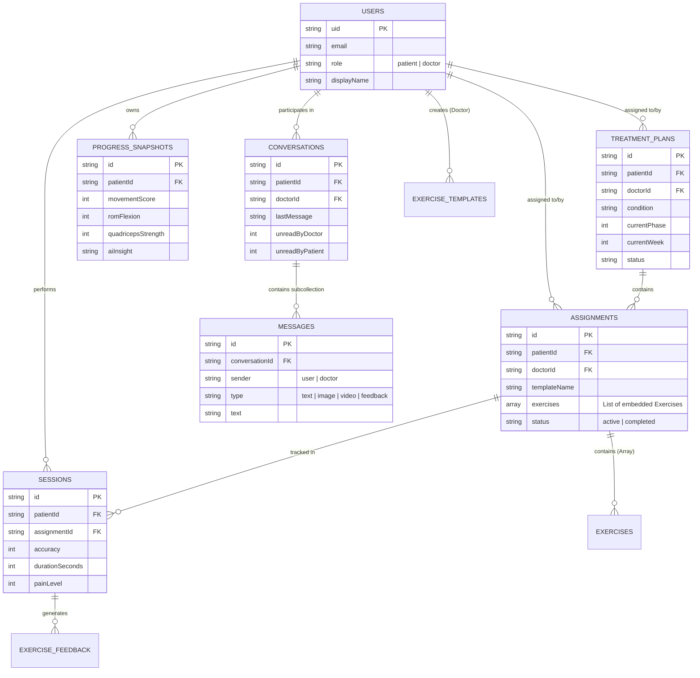

# TelePhysioAI Firebase Architecture

Tài liệu này mô tả chi tiết về cấu trúc cơ sở dữ liệu (Firestore), các Entities, mối quan hệ (Relationships) và các luồng nghiệp vụ (Business Flows) của tầng Backend Services trong ứng dụng TelePhysioAI.

## 1. Entity Relationship Diagram (ERD)

Dưới đây là sơ đồ thực thể mối quan hệ giữa các Collections trong Firestore:



---

## 2. Các Collections (Thực thể chính)

Hệ thống được thiết kế theo chuẩn **snake_case** để tối ưu với Firestore. Dưới đây là các bảng chính:

### 2.1. Nhóm Quản lý Người dùng (Users)
- **`users`**: Lưu trữ thông tin định danh và hồ sơ cá nhân. Phân quyền dựa trên trường `role` (`'patient'` hoặc `'doctor'`). Chứa thông tin như ngày sinh, số điện thoại, avatar, chuyên môn (nếu là bác sĩ).

### 2.2. Nhóm Kế hoạch & Bài tập (Core Clinical)
- **`treatment_plans`**: Kế hoạch điều trị dài hạn. Mỗi bệnh nhân thường có 1 Active Treatment Plan do bác sĩ chỉ định. Lưu trữ tình trạng bệnh, tuần/giai đoạn hiện tại và tiến độ.
- **`assignments`**: Các bài tập được giao (thường theo ngày hoặc tuần). Chứa trực tiếp mảng các bài tập (`exercises: Exercise[]`). Có trạng thái `'active'` hoặc `'completed'`.
- **`exercise_templates`**: Thư viện bài tập mẫu của riêng từng Bác sĩ, giúp họ giao bài nhanh chóng cho nhiều bệnh nhân khác nhau.
- **`exercises`**: Kho bài tập chung (Global) của toàn hệ thống (VD: Squat, Plank).

### 2.3. Nhóm Lịch sử & Báo cáo (Tracking & Progress)
- **`sessions`**: Lịch sử tập luyện thực tế của Bệnh nhân. Sinh ra sau khi kết thúc một Assignment. Ghi nhận độ chính xác (accuracy), thời gian tập (duration), và mức độ đau (painLevel).
- **`progress_snapshots`**: Các bản chụp (snapshot) tóm tắt tiến độ hàng tuần. Được AI tổng hợp và phân tích để đưa ra `aiInsight`, tính toán `movementScore`, và biên độ vận động (ROM).
- **`exercise_feedback`**: Phản hồi trực tiếp của Bệnh nhân sau mỗi Session tập luyện, hoặc phản hồi định kỳ.

### 2.4. Nhóm Tương tác (Communication)
- **`conversations`**: Các đoạn hội thoại giữa 1 Bác sĩ và 1 Bệnh nhân. Lưu trạng thái tin nhắn cuối cùng và số lượng tin nhắn chưa đọc.
- **`conversations/{id}/messages`**: Subcollection lưu trữ chi tiết từng dòng tin nhắn (bao gồm Text, Hình ảnh, Video, hoặc Thẻ Feedback).

### 2.5. Nhóm Tài nguyên (Resources)
- **`library_items`**: Kho tài liệu giáo dục (PDF, Bài viết, Video) hướng dẫn phục hồi chung cho toàn ứng dụng.

---

## 3. Kiến trúc Services (Backend Layer)

Toàn bộ logic tương tác với Firebase được chia thành các Service nhỏ gọn, đóng gói theo Domain để UI Components chỉ cần gọi các hàm bất đồng bộ (Promises).

### `authService.ts`
- **Nhiệm vụ**: Đăng nhập, Đăng ký, Đăng xuất, Phục hồi mật khẩu.
- **Luồng hoạt động**: Sử dụng Firebase Auth để lấy UID, sau đó tự động tạo Document trong collection `users` nếu là người dùng mới.

### `userService.ts`
- **Nhiệm vụ**: Lấy/Cập nhật hồ sơ người dùng.
- **Luồng hoạt động**: 
  - `getUser()`: Fetch thông tin cá nhân.
  - `getPatients()` (Doctor only): Fetch tất cả `treatment_plans` của bác sĩ -> Lấy danh sách `patientId` -> Load Profile của từng bệnh nhân.
  - `uploadAvatar()`: Đẩy ảnh lên Firebase Storage và update field `avatarUrl`.

### `assignmentService.ts`
- **Nhiệm vụ**: Quản lý Lộ trình và Bài tập.
- **Luồng hoạt động**:
  - **Màn Home**: Gọi `getActiveTreatmentPlan` để vẽ thanh Progress Bar và phase hiện tại.
  - **Màn Workout**: Gọi `getPatientAssignments` (chỉ lấy status='active') để Bệnh nhân bắt đầu tập.
  - **Màn Doctor**: Gọi `createAssignment` từ `exercise_templates` để gán cho Bệnh nhân.

### `progressService.ts`
- **Nhiệm vụ**: Ghi nhận kết quả tập & Phân tích AI.
- **Luồng hoạt động**:
  - Sau khi Bệnh nhân hoàn thành bài tập -> gọi `recordSession()` lưu vào `sessions`.
  - Hệ thống AI phân tích các sessions gần nhất -> lưu tổng hợp vào `progress_snapshots` bằng `saveProgressSnapshot()`.
  - **Màn Home / Progress**: Gọi `getLatestProgress` và `getProgressHistory` để vẽ các biểu đồ Chart (Sức mạnh, Độ linh hoạt).

### `chatService.ts`
- **Nhiệm vụ**: Xử lý nhắn tin Real-time.
- **Luồng hoạt động**:
  - `onMessagesChange()`: Gắn Listener (`onSnapshot`) trực tiếp vào subcollection `messages` để cập nhật UI theo thời gian thực mà không cần Refresh.
  - `sendMessage()`: Khi gửi, hệ thống tự động cập nhật `lastMessage` và tăng biến `unreadCount` ở collection cha (`conversations`).

### `libraryService.ts`
- **Nhiệm vụ**: Fetch dữ liệu khám phá, tài liệu phục hồi cho mục Library.

---

## 4. Đặc tả truy vấn & Indexing (Lưu ý kỹ thuật)

Vì Firestore là cơ sở dữ liệu NoSQL, toàn bộ ứng dụng tận dụng sức mạnh của **Composite Queries**:

1. **Lọc và Sắp xếp**: Đa số các luồng như *"Lấy bài tập của bệnh nhân A, sắp xếp theo thời gian mới nhất"* đều yêu cầu truy vấn dạng:
   ```typescript
   where('patientId', '==', uid),
   orderBy('date', 'desc')
   ```
2. **Composite Indexes**: Mọi câu lệnh kết hợp `where` + `orderBy` trên 2 field khác nhau BẮT BUỘC phải tạo Index trên Firebase Console (Các link báo lỗi đỏ trong Terminal chính là link tạo trực tiếp).
3. **Giới hạn Dữ liệu (Pagination/Limiting)**: Các hàm như `getProgressHistory` hay `getPatientSessions` luôn được bọc trong hàm `limit(10)` để tối ưu chi phí đọc (Read Operations) và giảm độ trễ hiển thị.
